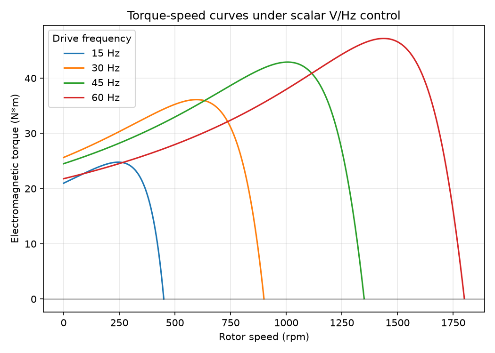
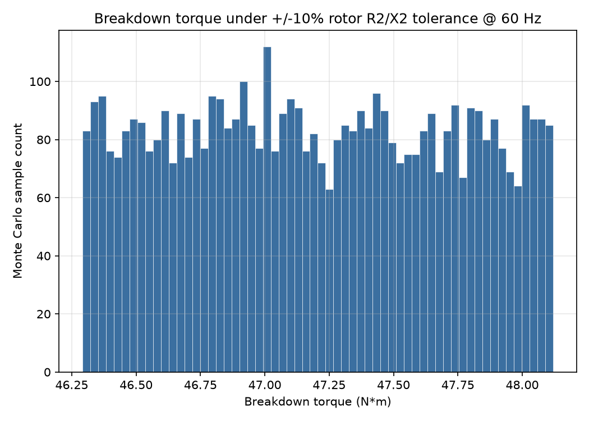

<div align="center">

# Julian Stiven Cardona Martinez

**Mechatronics Engineering Student · ECCI University, Bogota**

[](https://github.com/julianS-eng/julianS-eng/actions/workflows/ci.yml)
[](LICENSE)
[](pyproject.toml)

</div>

## About me

I'm a mechatronics engineering student at Universidad ECCI, about to graduate, with a focus on
electric drives, control systems, embedded systems, and robotics. My thesis studies variable
frequency drives (VFDs) for induction motors, validated on a LabVolt/FESTO electrical-machines
training bench: scalar V/Hz control, torque-speed behavior, and the practical trade-offs of
running an induction machine away from its nameplate frequency.

I'm looking for my first opportunity as a mechatronics/controls/embedded engineer, where I can
bring together circuit-level understanding of electric machines, real-time embedded firmware, and
applied control theory. This repository is both my GitHub profile page and a small, fully tested
engineering artifact: the equivalent-circuit induction-motor simulation below is real, runnable
code, not a mockup — every number and figure in this README was produced by running it.

## Skills


## Featured projects

- **[induction-motor-vfd-sim](https://github.com/julianS-eng/induction-motor-vfd-sim)** — Variable-frequency-drive control and simulation for a 3-phase induction motor, extending the thesis work on the LabVolt/FESTO bench.
- **[esp32-freertos-espnow-mesh](https://github.com/julianS-eng/esp32-freertos-espnow-mesh)** — A FreeRTOS-based ESP32 mesh network over ESP-NOW for low-latency sensor/actuator messaging without a Wi-Fi router.
- **[Control-lab-inverted-pendulum](https://github.com/julianS-eng/Control-lab-inverted-pendulum)** — Classical and state-space control (PID / LQR) of an inverted-pendulum test rig, from linearized model to bench validation.
- **[vision-line-follower-sim](https://github.com/julianS-eng/vision-line-follower-sim)** — OpenCV-based vision pipeline and simulator for a line-following mobile robot.
- **[tinyml-vibration-classifier](https://github.com/julianS-eng/tinyml-vibration-classifier)** — TensorFlow Lite Micro model for on-device vibration-signature classification, aimed at predictive maintenance on rotating machinery.

> Projects built with AI-assisted development; design decisions, validation and hardware testing by me.

## This repository: a reproducible induction-motor / VFD simulation

Rather than a static profile page, this repository ships a small, typed, tested Python package
(`src/imvfd_demo/`) that implements the standard steady-state, per-phase equivalent-circuit model
of a 3-phase squirrel-cage induction motor (Thevenin-equivalent torque equation) under open-loop
**scalar V/Hz control** — the same control strategy used on the LabVolt/FESTO VFD bench referenced
in my thesis. Every figure and number below comes from running `generate-report` in this
repository; nothing here is hand-typed or estimated.

### Torque-speed curves under scalar V/Hz control



Family of torque-speed curves for the illustrative example machine (`EXAMPLE_MOTOR`: 208 V,
60 Hz, 4-pole, per-phase equivalent circuit — see `src/imvfd_demo/motor_model.py` for the exact
parameters and their textbook source) swept at 15/30/45/60 Hz under a V/Hz ramp with an 8 V
low-speed boost. Peak (breakdown) torque drops off at low frequency because the fixed voltage
boost cannot fully offset the stator IR drop relative to the shrinking flux-producing voltage —
a well-known practical limitation of scalar (vs. vector) control at low speed.

| f (Hz) | V line (V) | n_sync (rpm) | Starting T (N·m) | Breakdown T (N·m) | Breakdown speed (rpm) | Breakdown slip |
|---|---|---|---|---|---|---|
| 15 | 58.0  | 450  | 20.98 | 24.78 | 245  | 0.4549 |
| 30 | 108.0 | 900  | 25.64 | 36.11 | 597  | 0.3368 |
| 45 | 158.0 | 1350 | 24.51 | 42.91 | 1006 | 0.2547 |
| 60 | 208.0 | 1800 | 21.79 | 47.19 | 1437 | 0.2014 |

### Breakdown-torque sensitivity to rotor-parameter tolerance



Real machines don't match their nameplate parameters exactly: rotor resistance and leakage
reactance vary with manufacturing tolerance and rotor temperature. To quantify the effect on
pull-out (breakdown) torque, the rotor parameters `R2`, `X2` are drawn from a **seeded** uniform
distribution (±10% of nameplate) with `numpy.random.default_rng(seed=42)` and propagated through
5000 Monte Carlo samples at 60 Hz:

- mean breakdown torque: **47.198 N·m**
- standard deviation: **0.526 N·m**
- coefficient of variation: **1.11 %**
- min / max: **46.292 / 48.119 N·m**

Because the seed is fixed, this study — and the histogram above — is bit-for-bit reproducible;
see `tests/test_simulate.py::test_monte_carlo_is_reproducible_with_same_seed`.

### Reproducing these results

```bash
git clone https://github.com/julianS-eng/julianS-eng
cd julianS-eng
pip install -e ".[dev]"

pytest              # 27 tests
ruff check .         # lint
ruff format --check . # formatting
mypy src tests        # static typing (strict mode)

generate-report      # regenerates docs/img/*.png and prints the tables above
```

### Known limitations / future work

This demo is intentionally scoped to a steady-state, single-machine study; it does **not**
currently include (documented here rather than silently left out):

- **No transient/dynamic simulation.** The model is purely steady-state (algebraic slip/torque
  equations); there is no d-q dynamic model, no rotor inertia, and no closed-loop speed/current
  control loop.
- **Rotor skin effect is ignored.** `R2` is treated as constant with slip; real machines show a
  higher effective rotor resistance at high slip (e.g. at start) due to current crowding in the
  rotor bars.
- **No core, friction, or windage losses.** The magnetizing branch is purely reactive and
  mechanical losses are neglected, so absolute efficiency numbers are not modeled.
- **Illustrative parameters, not thesis bench data.** `EXAMPLE_MOTOR` is a widely used textbook
  equivalent-circuit example used to keep this repository's numbers reproducible and license-free;
  it is *not* a substitute for the actual LabVolt/FESTO bench measurements produced during the
  thesis.
- **Balanced 3-phase supply only.** Unbalanced voltage or single-phasing conditions are out of
  scope.
- **Featured-project links above point at planned/portfolio repositories** under this same GitHub
  account; not all of them are populated yet.

## Contact

- LinkedIn: `<LINKEDIN_PROFILE_URL>`
- Email: `<CONTACT_EMAIL>`

---

<sub>🇪🇸 Also available in Spanish: <a href="README.es.md">README.es.md</a> · Deep-dive theory,
design decisions, and interview Q&A (Spanish): <a href="docs/LEARNING.md">docs/LEARNING.md</a></sub>
